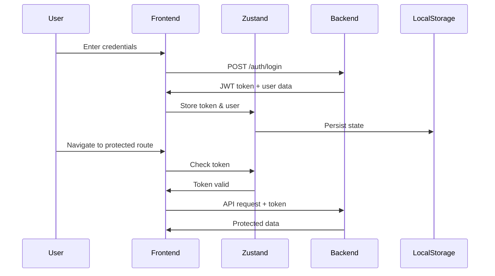

# 🌿 GreenScape - Frontend

A modern, responsive landscaping business management platform built with React, TypeScript, and Tailwind CSS.

[](https://your-live-site-url.com)
[](https://www.typescriptlang.org/)
[](https://reactjs.org/)
[](https://vitejs.dev/)
[](LICENSE)

## 🚀 Live Demo

**[View Live Site →](https://your-live-site-url.com)**

### Demo Credentials
- **Business Owner**: `owner@greenscape.com` / `demo123`
- **Manager**: `manager@greenscape.com` / `demo123`
- **Worker**: `worker@greenscape.com` / `demo123`

## 📋 Overview

GreenScape Frontend is a comprehensive web application designed for landscaping businesses to streamline operations from quote to completion. Built with modern web technologies, it provides an intuitive interface for business owners, managers, and workers to collaborate efficiently.

## ✨ Key Features

### 🏢 Business Management
- **📊 Dashboard Analytics** - Real-time business metrics, revenue tracking, and performance insights
- **📁 Project Management** - Complete project lifecycle from initial quote to completion
- **💰 Quote Generator** - Professional quotes with automated pricing calculations
- **📄 Invoice Management** - Generate, track, and manage customer invoices
- **🔧 Service Catalog** - Manage available landscaping services and pricing
- **📍 Site Visit Tracking** - Schedule and log customer site visits with notes

### 🧮 Planning & Estimation
- **📐 Material Calculator** - Intelligent material estimation for projects
  - Area calculations for lawns, gardens, and hardscapes
  - Volume calculations for soil, mulch, and gravel
  - Automated material quantity recommendations
  - Cost estimation based on current pricing

### 👥 Team & Workflow
- **👷 Team Management** - Manage workers, roles, and permissions
- **✅ Task Assignment** - Create, assign, and track tasks across teams
- **📅 Schedule Calendar** - Visual calendar for project scheduling and coordination
- **⏱️ Time Tracking** - Monitor worker hours and project time allocation

### 📈 Reports & Analytics
- **💵 Financial Reports** - Revenue, expenses, profit margins, and payment tracking
- **📊 Project Analytics** - Project status, completion rates, and performance metrics
- **👤 Worker Performance** - Individual and team productivity tracking
- **📉 Trend Analysis** - Historical data visualization and insights

### 🔐 Security & Access Control
- **🔑 Role-Based Access** - Customized views and permissions for each user role
- **🛡️ JWT Authentication** - Secure token-based authentication system
- **👤 Profile Management** - User profiles, settings, and preferences
- **🔒 Protected Routes** - Secure access to sensitive business data

## 🛠️ Tech Stack

| Technology | Version | Purpose |
|------------|---------|---------|
| **React** | 18.2 | UI Library |
| **TypeScript** | 5.2 | Type Safety |
| **Vite** | 5.0 | Build Tool & Dev Server |
| **React Router DOM** | 6.20 | Client-side Routing |
| **Zustand** | 4.4 | State Management |
| **Axios** | 1.6 | HTTP Client |
| **Tailwind CSS** | 3.3 | Utility-first Styling |
| **PostCSS** | 8.4 | CSS Processing |
| **ESLint** | 8.53 | Code Linting |

## 📁 Project Structure

```
src/
├── components/              # Reusable UI components
│   ├── layouts/            # Layout wrappers
│   │   └── MainLayout.tsx  # Main app layout with navigation
│   └── ui/                 # UI primitives
│       └── Icons.tsx       # SVG icon components
│
├── context/                # Global state management
│   └── authStore.ts        # Authentication state (Zustand)
│
├── pages/                  # Page components (routes)
│   ├── HomePage.tsx        # Landing page
│   │
│   ├── auth/              # Authentication pages
│   │   ├── LoginPage.tsx
│   │   ├── RegisterPage.tsx
│   │   ├── ForgotPasswordPage.tsx
│   │   └── ProfileSetupPage.tsx
│   │
│   ├── shared/            # Shared between roles
│   │   ├── DashboardPage.tsx
│   │   └── LoginPage.tsx
│   │
│   ├── projects/          # Project management
│   │   ├── ProjectsPage.tsx
│   │   ├── ProjectDetailsPage.tsx
│   │   └── NewProjectPage.tsx
│   │
│   ├── quotes/            # Quote generation
│   │   ├── QuotesPage.tsx
│   │   └── NewQuotePage.tsx
│   │
│   ├── invoices/          # Invoice management
│   │   ├── InvoicesPage.tsx
│   │   └── NewInvoicePage.tsx
│   │
│   ├── tasks/             # Task management
│   │   ├── TasksPage.tsx
│   │   └── NewTaskPage.tsx
│   │
│   ├── calculator/        # Material calculator
│   │   └── MaterialCalculatorPage.tsx
│   │
│   ├── materials/         # Material inventory
│   │   └── MaterialsPage.tsx
│   │
│   ├── schedule/          # Calendar scheduling
│   │   └── SchedulePage.tsx
│   │
│   ├── team/              # Team management
│   │   └── TeamPage.tsx
│   │
│   ├── worker/            # Worker-specific views
│   │   └── WorkerDashboard.tsx
│   │
│   ├── profile/           # User profile
│   │   ├── ProfilePage.tsx
│   │   └── EditProfilePage.tsx
│   │
│   ├── reports/           # Analytics and reports
│   │   └── ReportsPage.tsx
│   │
│   └── settings/          # Application settings
│       └── SettingsPage.tsx
│
├── services/              # API layer
│   └── api.ts             # Axios instance, interceptors, API calls
│
├── types/                 # TypeScript definitions
│   └── index.ts           # Shared type definitions
│
├── App.tsx                # Root component with routing
├── main.tsx               # Application entry point
├── index.tsx              # Alternative entry
├── index.css              # Global styles & Tailwind imports
└── vite-env.d.ts          # Vite type definitions
```

## 🚀 Getting Started

### Prerequisites

- **Node.js** 16.x or higher ([Download](https://nodejs.org/))
- **npm** or **yarn** package manager
- **GreenScape Backend API** running ([Backend Repository](https://github.com/yourusername/greenscape-backend))

### Installation

1. **Clone the repository**
```bash
git clone https://github.com/yourusername/greenscape-frontend.git
cd greenscape-frontend
```

2. **Install dependencies**
```bash
npm install
# or
yarn install
```

3. **Configure environment variables**

Create a `.env` file in the root directory:

```env
# Backend API URL
VITE_API_URL=http://localhost:8080

# Optional: Enable debug mode
VITE_DEBUG=true
```

4. **Start development server**
```bash
npm run dev
```

The application will be available at **`http://localhost:5173`**

### Build for Production

```bash
# Type-check and build
npm run build

# Output will be in the dist/ directory
```

### Preview Production Build

```bash
npm run preview
```

## 🔧 Available Scripts

| Command | Description |
|---------|-------------|
| `npm run dev` | Start development server with hot module replacement |
| `npm run build` | Type-check and build for production |
| `npm run preview` | Preview production build locally |
| `npm run lint` | Run ESLint to check code quality |

## 🎨 Features by User Role

### 👔 Business Owner
- **Full Dashboard Access** - Complete business overview with all metrics
- **Project Management** - Create, edit, and delete projects
- **Quote Creation** - Generate professional quotes with pricing
- **Invoice Generation** - Create and manage customer invoices
- **Team Management** - Add/remove team members, assign roles
- **Material Calculator** - Plan materials for projects
- **Financial Reports** - Revenue, expenses, profit analysis
- **Settings Control** - Configure business settings and preferences

### 👨‍💼 Manager
- **Manager Dashboard** - Project and team oversight
- **Project Tracking** - Monitor project status and progress
- **Task Management** - Create and assign tasks to workers
- **Schedule Management** - Coordinate project timelines
- **Team Coordination** - Manage worker assignments
- **Material Planning** - Use calculator for estimations
- **Performance Reports** - View team and project metrics

### 👷 Worker
- **Worker Dashboard** - Personal task view and schedule
- **Assigned Tasks** - View and update task status
- **Schedule Calendar** - See upcoming assignments
- **Time Tracking** - Log work hours
- **Project Details** - Access relevant project information
- **Task Updates** - Mark tasks as in-progress or completed

## 🔐 Authentication Flow



1. User submits login credentials
2. Backend validates and returns JWT token + user data
3. Token stored in Zustand state (auto-persisted to localStorage)
4. Token included in all API requests via Axios interceptor
5. Protected routes check for valid token before rendering
6. Automatic redirect to login if token is missing/expired

## 🌐 API Integration

All API communication is centralized in `src/services/api.ts`:

```typescript
import api from '@/services/api';

// GET request
const projects = await api.get('/projects');

// POST request
const newProject = await api.post('/projects', {
  name: 'New Landscaping Project',
  client_name: 'John Doe',
  // ...
});

// PUT request
await api.put(`/projects/${id}`, updatedData);

// DELETE request
await api.delete(`/projects/${id}`);
```

### Axios Interceptors

**Request Interceptor** - Automatically adds JWT token:
```typescript
api.interceptors.request.use((config) => {
  const token = useAuthStore.getState().token;
  if (token) {
    config.headers.Authorization = `Bearer ${token}`;
  }
  return config;
});
```

**Response Interceptor** - Handles authentication errors:
```typescript
api.interceptors.response.use(
  (response) => response,
  (error) => {
    if (error.response?.status === 401) {
      // Clear auth state and redirect to login
      useAuthStore.getState().logout();
    }
    return Promise.reject(error);
  }
);
```

## 📱 Responsive Design

- **📱 Mobile-First** - Optimized for smartphones (320px+)
- **📲 Tablet Support** - Responsive layouts for tablets (768px+)
- **💻 Desktop Enhanced** - Full feature set on desktop (1024px+)
- **👆 Touch-Friendly** - Large click targets and swipe gestures
- **🎨 Adaptive UI** - Components adapt to screen size

## 🎨 UI/UX Features

- **✨ Clean Interface** - Modern, professional design
- **🧭 Intuitive Navigation** - Easy-to-use menu and routing
- **✅ Form Validation** - Real-time input validation
- **⏳ Loading States** - Skeleton screens and spinners
- **🚨 Error Handling** - User-friendly error messages
- **🔔 Toast Notifications** - Success/error feedback
- **♿ Accessibility** - ARIA labels and keyboard navigation
- **🎭 Smooth Transitions** - Polished animations and transitions

## 🧪 Testing

```bash
# Run tests (when configured)
npm test

# Run tests with coverage
npm test -- --coverage

# Run tests in watch mode
npm test -- --watch
```

## 🚀 Deployment

### Vercel (Recommended)

1. Push code to GitHub
2. Import repository to Vercel
3. Configure environment variables
4. Deploy automatically on push

### Netlify

```bash
npm run build
# Deploy the dist/ directory
```

### Docker

```dockerfile
FROM node:18-alpine AS build
WORKDIR /app
COPY package*.json ./
RUN npm install
COPY . .
RUN npm run build

FROM nginx:alpine
COPY --from=build /app/dist /usr/share/nginx/html
EXPOSE 80
CMD ["nginx", "-g", "daemon off;"]
```

## 🔗 Related Repositories

- **[GreenScape Backend](https://github.com/yourusername/greenscape-backend)** - Rust API server with PostgreSQL

## 🐛 Known Issues

- None currently reported

## 🗺️ Roadmap

- [ ] Dark mode support
- [ ] Multi-language support (i18n)
- [ ] Offline mode with service workers
- [ ] Push notifications
- [ ] Advanced reporting with charts
- [ ] Export data to Excel/PDF
- [ ] Mobile app (React Native)

## 📄 License

This project is licensed under the MIT License - see the [LICENSE](LICENSE) file for details.

## 🤝 Contributing

Contributions are welcome! Please follow these guidelines:

1. **Fork** the repository
2. **Create** a feature branch (`git checkout -b feature/AmazingFeature`)
3. **Commit** your changes (`git commit -m 'Add some AmazingFeature'`)
4. **Push** to the branch (`git push origin feature/AmazingFeature`)
5. **Open** a Pull Request

### Code Style

- Follow TypeScript best practices
- Use functional components with hooks
- Write descriptive variable names
- Add comments for complex logic
- Ensure all TypeScript types are defined

## 👨‍💻 Author

**Your Name**
- GitHub: [@yourusername](https://github.com/yourusername)
- Twitter: [@yourtwitter](https://twitter.com/yourtwitter)
- LinkedIn: [Your Name](https://linkedin.com/in/yourprofile)

## 🙏 Acknowledgments

- [React](https://reactjs.org/) - UI library
- [Vite](https://vitejs.dev/) - Build tool
- [Tailwind CSS](https://tailwindcss.com/) - CSS framework
- [Zustand](https://github.com/pmndrs/zustand) - State management
- [Axios](https://axios-http.com/) - HTTP client
- [React Router](https://reactrouter.com/) - Routing
- [Heroicons](https://heroicons.com/) - Icon set

## 📞 Support

For support, email support@greenscape.com or open an issue in the repository.

---

**[⬆ Back to Top](#-greenscape---frontend)**

Made with ❤️ for landscaping professionals
